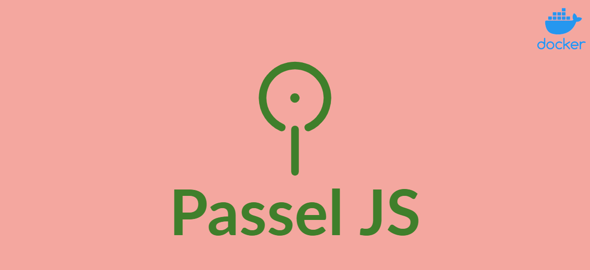
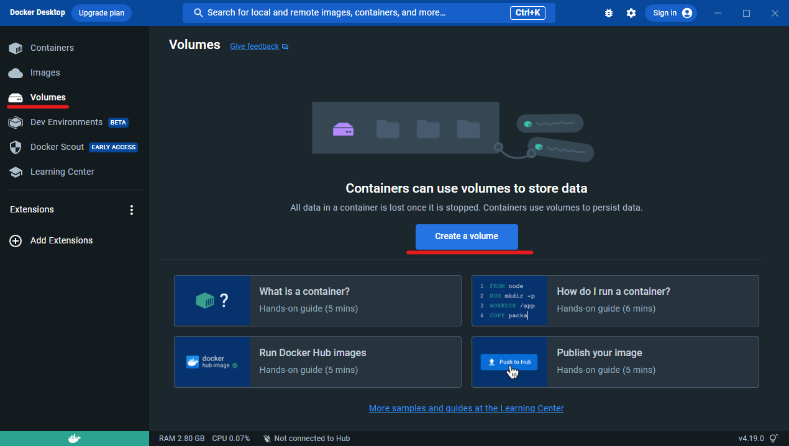
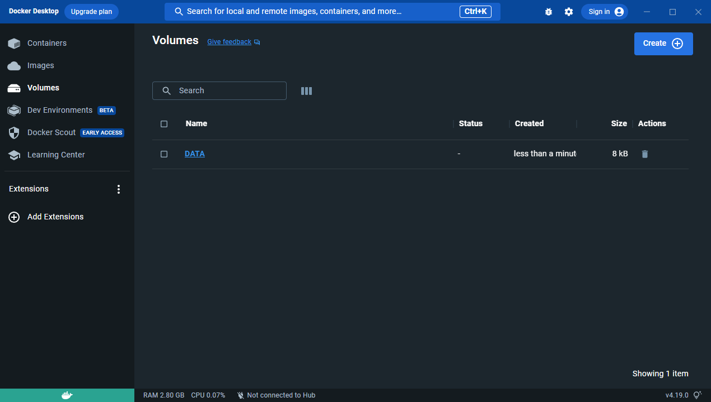
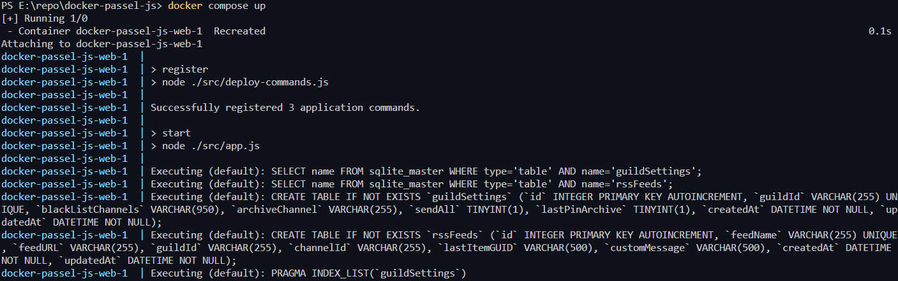

# Docker Implementation

## Contents

- [Prerequisites](#prerequisites)
- [Setup](#setup)
- [Running the container](#running-the-container)

## Prerequisites

In order to use this implementation of Passel JS, you must have a docker environment setup on your computer. Any docker container manager will work, if you're not sure what to use I suggest Docker Desktop to start.

- [Docker Desktop Installation for Windows](https://docs.docker.com/desktop/install/windows-install/)
- [Docker Desktop Installation for MacOS](https://docs.docker.com/desktop/install/mac-install/)
- [Docker Desktop Installation for Linux](https://docs.docker.com/desktop/install/linux-install/)

There are many other docker environment managers that you can choose. The following instructions will be specific to Docker Desktop GUI, however CLI commands will be provided as well. Allowing anyone to setup and run their personal bot.

## Setup

Once you have your docker environment setup, you'll need to create your docker compose file, and .env file. In this repo, there is a compose and sample env file already provided for easy integration or new instance.

- [docker-compose.yml](docker-compose.yml)
- [.env.sample](.env.sample)

Download both files and place in a folder of your choice.

### Edit .env.sample

Rename `.env.sample` to `.env`. This file will contain environment variables referenced inside `docker-compose.yml`. Each variable must be set before continue.

- `TOKEN=`: Paste your discord bot token. See [PasselJS Read Me](https://github.com/somedumbfox/passel-js#create-your-discord-bot) for instructions on how to obtain.
- `clientId=`: Paste your discord application id here.
- `SQL=`: This is the path to the SQLite DB file. If you don't know what to do use `/data/db.SQLite`.
- `SQLUser=`: This is the Username to access the SQLite DB. Any name will do.
- `SQLPass=`: This is the Password to access the SQLite DB. Any password will do.
- `TASKINTERVAL=`: This is the number of seconds to wait in between feed update checks. Use `600` for 10 minutes.
- `DATAPATH`= This is the path the DATA volume must map for DB persistance. If you don't know what do do, use `/data/`.

That is it for the environment variables!

### Create DATA volume for Docker

The next step is the create the external volume for Docker to use. When you launch Docker Desktop, you're greated with a GUI similar to the screenshot below. Select Volumes on the left, and then select Create a Volume.

Then input the name `DATA` for the volume name.

On success, you should now see a Volume named `DATA`

Note, the external Volume is named `DATA` in the docker compose file. If you wish to use a different name or an existing volume. Update both the environment variable and compose file to your preferences.

If you're not using Docker Desktop, or prefer to use CLI, input the following command in your terminal program to create your volume.

`docker volume create DATA`

## Running the Container

Now, open a terminal window and change your directory to where your `docker-compose.yml` and `.env` file is located. Type the following command to run the image.

`docker compose up`

If your setup is correct, then you should see your commands register successfully, and passelJS start. That's it, you're now running a containerized version of Passel JS

